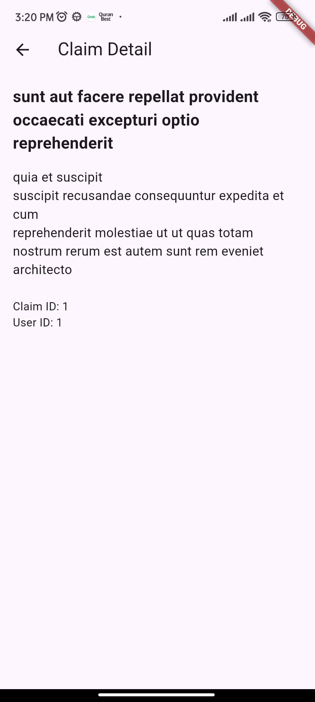

# claims_app

A flutter app for displaying insurance claims

## Setup Instructions
1. Clone the repository: `git clone https://github.com/rfahri/claims_app.git`
2. Navigate to the project directory: `cd claims_app`
3. Install dependencies: `flutter pub get`
4. Run the app: `flutter run`
5. Run build runner for testing : `dart run build_runner build --delete-conflicting-outputs`

## App Preview

